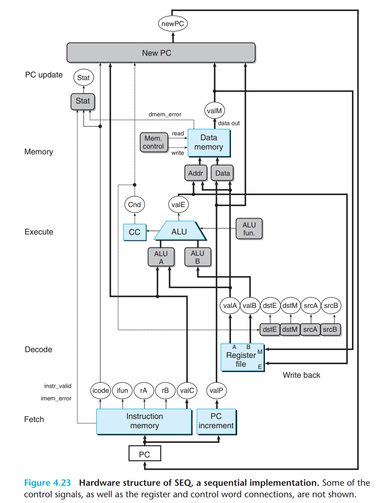
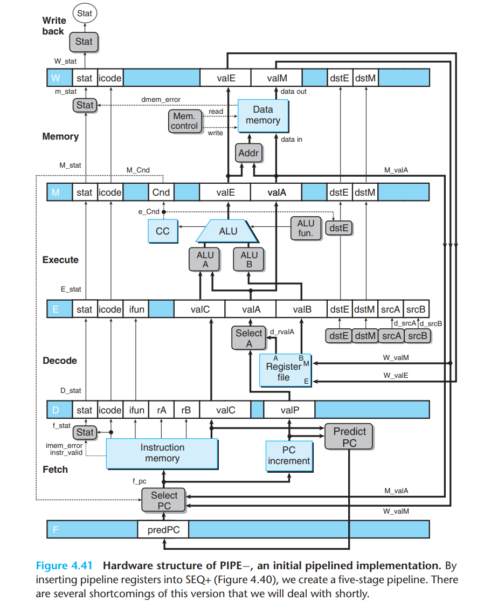
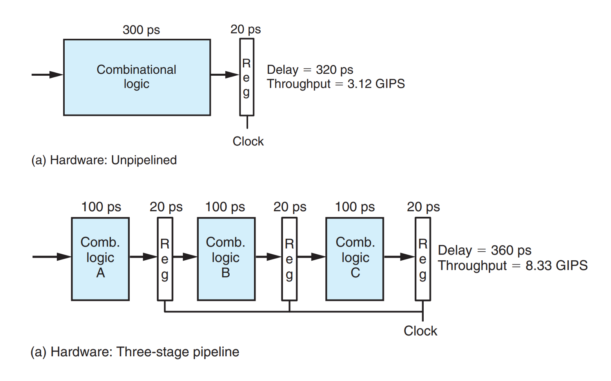

# 前置知识

## Y86

esp - rsp 第三版CSAPP全部使用8Byte

Y86指令集对应Y86处理器，Sequential operation，每个周期执行一个完整的Y86指令，可以拆分出五个阶段，执行指令流水线（？数字电路的实现）

programmer-visible 程序员可见的状态，编译器 / 用汇编代码写程序的人，Y86与x86对应的寄存器结构是类似的，栈指针、传参、返回参数、条件码、PC。

Y86的汇编指令使用内存虚拟地址，由硬件和操作系统在读入程序时载入。状态码Stat 异常状态。

只有8字节的数据，称之为word 字，变长指令字，

addl, subl, andl, and xorl 对应 ZF, SF, and OF (zero, sign, and overflow)

## HCL

硬件控制语言，从逻辑电路图到硬件描述语言，Verilog 根据描述生成电路，high-level Language。Single  Bit，高电平表示1，反之表示0，与或非门。基本的对象时逻辑电路，bool eq = (a && b) || (!a && !b) ，持续响应输入的变化。

出于简单，每个字集都视为int，有 bool Eq = (A == B)。

基于设计的存储网络，决定各个存储设备值的组合电路逻辑。

### 硬件基础

组合电路，不需要时序信息，参考三极管等原件的特性，输入改变自然输出改变。若要生成有顺序的时序电路，需要引入时钟。

时钟寄存器（区分机器级编程提到的寄存器文件），只有在时钟上升沿才会改变自身的输出，就可以确保数据之间读取改变的先后顺序。

随机访问存储器（内存+寄存器文件）；在读取时等价于组合电路，只需要输入改变（寻址改变）输出随之改变（对应寄存器的值）； 在写入时则不同，由一个时钟控制。因此只读存储器，如指令存储器可以看作组合电路。



6类操作

1. Fetch icode(指令代码) + ifun(指令功能 指导ALU) + (rA rB reg) + valp(顺序计算Increment)
2. Decode 等价组合逻辑电路 读出ALU A ALU B  
3. Execute ALU运算(参考ifun)，设置条件码（condition code register (CC)），ifun给出传送条件
4. Memory 写/读 valM
5. Write Back 写回存储器
6. 更新PC

单个周期内，Y86-64的指令集不会读出现过写的状态。在时钟下，Input PC改变，当组合电路稳定之后，因为只取决于上一阶段的值，可以确保同时进行。(写操作需要另外的时钟，这里简化讨论)


具体而言：

对条件转移，不会有运算设置完条件码后，直接读取条件码。只有运算后，才另外判断jmp。

对pushq而言，并不能rsp-8后直接M(rsp)，而应该使用rsp-8得到的valE，直接M(valE)（同时写入rsp)。

### Pipeline

使用流水线操作，借助时钟使得上个Stage结束的同时，下个Stage正好开始即可（选择每个Stage最长的时间，就可以只用一个统一的时钟。



比较Seq结构与Pipe结构，虽然单个指令的执行时间甚至更长，但可以同时运行至多三个指令，使得整体的吞吐量更大。流水线需要每个组合逻辑的耗时相同，长链条也使得更有效率的设计更困难(Nonuniform Partitioning)流水线链条越长，需要处理的冲突越多，寄存器用于等待的时间也越长(Diminishing Returns of Deep Pipelining)



Pipeline Hazard 数据冒险 控制冒险

Stall - 等价于动态生成所需数量的nop指令 

Forward 数据旁路，可以处理寄存器写后读的问题，不能处理 load/use，读内存在写入阶段才得到操作数。后者依旧使用Stall(load interlock)。

控制冒险，在得到准确的跳转PC前的所有阶段都应该插入nop

异常处理。

# 具体流程

## Part A

汇编程序

定义出链表的结构

```assembly
# Sample linked list
.align 8
ele1:
	.quad 0x00a
	.quad ele2
ele2:
	.quad 0x0b0
	.quad ele3
ele3:
	.quad 0xc00
	.quad 0
```

C语言传参与处理的汇编代码

main函数内定义

```c
# C 需要struct Node代表结构体，一般辅助使用typedef 
typedef struct Node{
    int v;
    struct Node *next;
}Node;

int add(Node *head) {
    int v = 0;
    while(head) {
        v += head->v;
        head = head->next; 
    }
}

int main() {
    Node n1, n2, n3;
    n1.v = 1, n1.next = &n2, n2.v = 2, n2.next = &n3, n3.v = 3, n3.next = 0;
    add(&n1); 
}
```

```assembly
# ATT 格式 x86 

# 申请空间
subq	$64, %rsp
# ? 段保护
movq	%fs:40, %rax
# 占一个8Byte
movq	%rax, -8(%rbp)
# 清 0
xorl	%eax, %eax

# n1.v = 1
movl	$1, -64(%rbp)

# &n2 -> n1.next
leaq	-48(%rbp), %rax
movq	%rax, -56(%rbp)

# n2.v = 2, 同时代表&n2
movl	$2, -48(%rbp)
leaq	-32(%rbp), %rax
movq	%rax, -40(%rbp)
movl	$3, -32(%rbp)
movq	$0, -24(%rbp)

# 传入 &n1
leaq	-64(%rbp), %rax

movq	%rax, %rdi
```

全局变量的定义

```c
typedef struct Node{
    int v;
    struct Node *next;
}Node;

Node n3 = {3, 0}, n2 = {2, &n3}, n1 = {1, &n2};

int add(Node *head) {
    int v = 0;
    while(head) {
        v += head->v;
        head = head->next; 
    }
}

int main() {
    add(&n1); 
}
```

```assembly
n3:
	.long	3
	.zero	4
	.quad	0
	.globl	n2
	.section	.data.rel.local,"aw"
	.align 16
	.type	n2, @object
	.size	n2, 16
n2:
	.long	2
	.zero	4
	.quad	n3
	.globl	n1
	.align 16
	.type	n1, @object
	.size	n1, 16
n1:
	.long	1
	.zero	4
	.quad	n2
	.text
	.globl	add
	.type	add, @function

# [rip + a] or AT&T a(%rip) means to calculate a rel32 displacement to reach a

# 代表n1的地址 （指向代码段而不是栈，代表全局变量）
leaq	n1(%rip), %rdi

# 后借助8 Byte后的地址完成跳转
movq	-24(%rbp), %rax
movq	8(%rax), %rax
```

ys中都使用全局变量的方式，寻址的方式也较为简单

注意有INIT的过程，需要手动声明栈大小等。

```assembly
# Sample linked list
    .pos 0
    irmovq stack, %rsp 
    call main
    halt
    
    .align 8
ele1:
	.quad 0x00a
	.quad ele2
ele2:
	.quad 0x0b0
	.quad ele3
ele3:
	.quad 0xc00
	.quad 0

main:
    irmovq ele1, %rdx
    pushq %rdx
    call add
    ret

add:
    pushq %rbp
    rrmovq %rsp, %rbp
    xorq %rax, %rax
    mrmovq 16(%rbp), %rcx
loop:
    andq %rcx, %rcx
    je end
    mrmovq (%rcx), %rdx
    addq %rdx, %rax
    mrmovq 8(%rcx), %rcx
    jmp loop
end: 
    popq %rbp
    ret    

    .pos 200
stack:
```

结果

```
Stopped in 33 steps at PC = 0x18.  Status 'HLT', CC Z=1 S=0 O=0
Changes to registers:
%rax:   0x0000000000000000      0x0000000000000cba
```

```assembly
main:
    irmovq ele1, %rdi
    call rsum
    ret

rsum:
    xorq %rax, %rax 
    andq %rdi, %rdi
    je end
    pushq %rbp
    rrmovq %rsp, %rbp 
    mrmovq (%rdi), %rcx
    mrmovq 8(%rdi), %rdi
    pushq %rcx
    call rsum
    popq %rcx
    addq %rcx, %rax 
    rrmovq %rbp, %rsp
    popq %rbp
end:
    ret 

# 十进制 200会爆栈
    .pos 0x200
stack:
```

结果：

```
Stopped in 52 steps at PC = 0x13.  Status 'HLT', CC Z=0 S=0 O=0
Changes to registers:
%rax:   0x0000000000000000      0x0000000000000cba
```

```assembly
# Source block
src:
    .quad 0x00a
    .quad 0x0b0
    .quad 0xc00

# Destination block
dest:
    .quad 0x111
    .quad 0x222
    .quad 0x333

copy:
    mrmovq 8(%rsp), %rdx
    mrmovq 16(%rsp), %rcx
    mrmovq 24(%rsp), %rbx
    xorq %rax, %rax   
loop:
    andq %rdx, %rdx
    je end
    irmovq $-1, %r8
    addq %r8, %rdx
    mrmovq (%rbx), %r8
    xorq %r8, %rax
    rmmovq %r8, (%rcx) 
    irmovq $8, %r8
    addq %r8, %rcx
    addq %r8, %rbx  
    jmp loop
end:
    ret

main:
    irmovq src, %rdx
    pushq %rdx
    irmovq dest, %rdx
    pushq %rdx
    irmovq 0x3, %rdx
    pushq %rdx
    call copy
    ret

    .pos 0x200
stack:
```

结果

```
Stopped in 51 steps at PC = 0x3.  Status 'HLT', CC Z=1 S=0 O=0
Changes to registers:
%rax:   0x0000000000000000      0x0000000000000cba
%rcx:   0x0000000000000000      0x0000000000000048
%rbx:   0x0000000000000000      0x0000000000000030
%rsp:   0x0000000000000000      0x00000000000001e8
%r8:    0x0000000000000000      0x0000000000000008

Changes to memory:
0x0030: 0x0000000000000111      0x000000000000000a
0x0038: 0x0000000000000222      0x00000000000000b0
0x0040: 0x0000000000000333      0x0000000000000c00
```

## Part B

只需要在固定的结构中加入操作码即可。

```
################ Fetch Stage     ###################################

# Determine instruction code
word icode = [
	imem_error: INOP;
	1: imem_icode;		# Default: get from instruction memory
];

# Determine instruction function
word ifun = [
	imem_error: FNONE;
	1: imem_ifun;		# Default: get from instruction memory
];

bool instr_valid = icode in 
	{ INOP, IHALT, IRRMOVQ, IIRMOVQ, IRMMOVQ, IMRMOVQ,
	       IOPQ, IJXX, ICALL, IRET, IPUSHQ, IPOPQ, IIADDQ};

# Does fetched instruction require a regid byte?
bool need_regids =
	icode in { IRRMOVQ, IOPQ, IPUSHQ, IPOPQ, 
		     IIRMOVQ, IRMMOVQ, IMRMOVQ, IIADDQ};

# Does fetched instruction require a constant word?
bool need_valC =
	icode in { IIRMOVQ, IRMMOVQ, IMRMOVQ, IJXX, ICALL, IIADDQ};

################ Decode Stage    ###################################

## What register should be used as the A source?
word srcA = [
	icode in { IRRMOVQ, IRMMOVQ, IOPQ, IPUSHQ  } : rA;
	icode in { IPOPQ, IRET } : RRSP;
	1 : RNONE; # Don't need register
];

## What register should be used as the B source?
word srcB = [
	icode in { IOPQ, IRMMOVQ, IMRMOVQ, IIADDQ} : rB;
	icode in { IPUSHQ, IPOPQ, ICALL, IRET } : RRSP;
	1 : RNONE;  # Don't need register
];

## What register should be used as the E destination?
word dstE = [
	icode in { IRRMOVQ } && Cnd : rB;
	icode in { IIRMOVQ, IOPQ, IIADDQ} : rB;
	icode in { IPUSHQ, IPOPQ, ICALL, IRET } : RRSP;
	1 : RNONE;  # Don't write any register
];

## What register should be used as the M destination?
word dstM = [
	icode in { IMRMOVQ, IPOPQ } : rA;
	1 : RNONE;  # Don't write any register
];

################ Execute Stage   ###################################

## Select input A to ALU
word aluA = [
	icode in { IRRMOVQ, IOPQ } : valA;
	icode in { IIRMOVQ, IRMMOVQ, IMRMOVQ, IIADDQ } : valC;
	icode in { ICALL, IPUSHQ } : -8;
	icode in { IRET, IPOPQ } : 8;
	# Other instructions don't need ALU
];

## Select input B to ALU
word aluB = [
	icode in { IRMMOVQ, IMRMOVQ, IOPQ, ICALL, 
		      IPUSHQ, IRET, IPOPQ, IIADDQ} : valB;
	icode in { IRRMOVQ, IIRMOVQ } : 0;
	# Other instructions don't need ALU
];

## Set the ALU function
word alufun = [
	icode == IOPQ : ifun;
	1 : ALUADD;
];

## Should the condition codes be updated?
bool set_cc = icode in { IOPQ, IIADDQ};

################ Memory Stage    ###################################

## Set read control signal
bool mem_read = icode in { IMRMOVQ, IPOPQ, IRET };

## Set write control signal
bool mem_write = icode in { IRMMOVQ, IPUSHQ, ICALL };

## Select memory address
word mem_addr = [
	icode in { IRMMOVQ, IPUSHQ, ICALL, IMRMOVQ } : valE;
	icode in { IPOPQ, IRET } : valA;
	# Other instructions don't need address
];

## Select memory input data
word mem_data = [
	# Value from register
	icode in { IRMMOVQ, IPUSHQ } : valA;
	# Return PC
	icode == ICALL : valP;
	# Default: Don't write anything
];

## Determine instruction status
word Stat = [
	imem_error || dmem_error : SADR;
	!instr_valid: SINS;
	icode == IHALT : SHLT;
	1 : SAOK;
];

################ Program Counter Update ############################

## What address should instruction be fetched at

word new_pc = [
	# Call.  Use instruction constant
	icode == ICALL : valC;
	# Taken branch.  Use instruction constant
	icode == IJXX && Cnd : valC;
	# Completion of RET instruction.  Use value from stack
	icode == IRET : valM;
	# Default: Use incremented PC
	1 : valP;
];
#/* $end seq-all-hcl */
```

## Part C

F - D - E - M - W

对其中设计的存储设备的值的逻辑进行设计。

基本的流水线操作：Average CPE   15.18

可以优化的结构：

Prediction

```asm
#/* $begin ncopy-ys */
##################################################################
# ncopy.ys - Copy a src block of len words to dst.
# Return the number of positive words (>0) contained in src.
#
# Include your name and ID here.
#
# Describe how and why you modified the baseline code.
#
##################################################################
# Do not modify this portion
# Function prologue.
# %rdi = src, %rsi = dst, %rdx = len
ncopy:

##################################################################
# You can modify this portion
	# Loop header
	xorq %rax,%rax		# count = 0;
	andq %rdx,%rdx		# len <= 0?
	jle Done		# if so, goto Done:

Loop:	
    mrmovq (%rdi), %r10	# read val from src...
	rmmovq %r10, (%rsi)	# ...and store it to dst
	andq %r10, %r10		# val <= 0?
	jle Npos		# if so, goto Npos:
	irmovq $1, %r10
	addq %r10, %rax		# count++

Npos:
	irmovq $1, %r10
	subq %r10, %rdx		# len--
	irmovq $8, %r10
	addq %r10, %rdi		# src++
	addq %r10, %rsi		# dst++
	andq %rdx,%rdx		# len > 0?
	jg Loop			# if so, goto Loop:
##################################################################
# Do not modify the following section of code
# Function epilogue.
Done:
	ret
##################################################################
# Keep the following label at the end of your function
End:
#/* $end ncopy-ys */

```


```
#/* $begin seq-all-hcl */
####################################################################
#  HCL Description of Control for Single Cycle Y86-64 Processor SEQ   #
#  Copyright (C) Randal E. Bryant, David R. O'Hallaron, 2010       #
####################################################################

## Your task is to implement the iaddq instruction
## The file contains a declaration of the icodes
## for iaddq (IIADDQ)
## Your job is to add the rest of the logic to make it work

####################################################################
#    C Include's.  Don't alter these                               #
####################################################################

quote '#include <stdio.h>'
quote '#include "isa.h"'
quote '#include "sim.h"'
quote 'int sim_main(int argc, char *argv[]);'
quote 'word_t gen_pc(){return 0;}'
quote 'int main(int argc, char *argv[])'
quote '  {plusmode=0;return sim_main(argc,argv);}'

####################################################################
#    Declarations.  Do not change/remove/delete any of these       #
####################################################################

##### Symbolic representation of Y86-64 Instruction Codes #############
wordsig INOP 	'I_NOP'
wordsig IHALT	'I_HALT'
wordsig IRRMOVQ	'I_RRMOVQ'
wordsig IIRMOVQ	'I_IRMOVQ'
wordsig IRMMOVQ	'I_RMMOVQ'
wordsig IMRMOVQ	'I_MRMOVQ'
wordsig IOPQ	'I_ALU'
wordsig IJXX	'I_JMP'
wordsig ICALL	'I_CALL'
wordsig IRET	'I_RET'
wordsig IPUSHQ	'I_PUSHQ'
wordsig IPOPQ	'I_POPQ'
# Instruction code for iaddq instruction
wordsig IIADDQ	'I_IADDQ'

##### Symbolic represenations of Y86-64 function codes                  #####
wordsig FNONE    'F_NONE'        # Default function code

##### Symbolic representation of Y86-64 Registers referenced explicitly #####
wordsig RRSP     'REG_RSP'    	# Stack Pointer
wordsig RNONE    'REG_NONE'   	# Special value indicating "no register"

##### ALU Functions referenced explicitly                            #####
wordsig ALUADD	'A_ADD'		# ALU should add its arguments

##### Possible instruction status values                             #####
wordsig SAOK	'STAT_AOK'	# Normal execution
wordsig SADR	'STAT_ADR'	# Invalid memory address
wordsig SINS	'STAT_INS'	# Invalid instruction
wordsig SHLT	'STAT_HLT'	# Halt instruction encountered

##### Signals that can be referenced by control logic ####################

##### Fetch stage inputs		#####
wordsig pc 'pc'				# Program counter
##### Fetch stage computations		#####
wordsig imem_icode 'imem_icode'		# icode field from instruction memory
wordsig imem_ifun  'imem_ifun' 		# ifun field from instruction memory
wordsig icode	  'icode'		# Instruction control code
wordsig ifun	  'ifun'		# Instruction function
wordsig rA	  'ra'			# rA field from instruction
wordsig rB	  'rb'			# rB field from instruction
wordsig valC	  'valc'		# Constant from instruction
wordsig valP	  'valp'		# Address of following instruction
boolsig imem_error 'imem_error'		# Error signal from instruction memory
boolsig instr_valid 'instr_valid'	# Is fetched instruction valid?

##### Decode stage computations		#####
wordsig valA	'vala'			# Value from register A port
wordsig valB	'valb'			# Value from register B port

##### Execute stage computations	#####
wordsig valE	'vale'			# Value computed by ALU
boolsig Cnd	'cond'			# Branch test

##### Memory stage computations		#####
wordsig valM	'valm'			# Value read from memory
boolsig dmem_error 'dmem_error'		# Error signal from data memory


####################################################################
#    Control Signal Definitions.                                   #
####################################################################

################ Fetch Stage     ###################################

# Determine instruction code
word icode = [
	imem_error: INOP;
	1: imem_icode;		# Default: get from instruction memory
];

# Determine instruction function
word ifun = [
	imem_error: FNONE;
	1: imem_ifun;		# Default: get from instruction memory
];

bool instr_valid = icode in 
	{ INOP, IHALT, IRRMOVQ, IIRMOVQ, IRMMOVQ, IMRMOVQ,
	       IOPQ, IJXX, ICALL, IRET, IPUSHQ, IPOPQ, IIADDQ};

# Does fetched instruction require a regid byte?
bool need_regids =
	icode in { IRRMOVQ, IOPQ, IPUSHQ, IPOPQ, 
		     IIRMOVQ, IRMMOVQ, IMRMOVQ, IIADDQ};

# Does fetched instruction require a constant word?
bool need_valC =
	icode in { IIRMOVQ, IRMMOVQ, IMRMOVQ, IJXX, ICALL, IIADDQ};

################ Decode Stage    ###################################

## What register should be used as the A source?
word srcA = [
	icode in { IRRMOVQ, IRMMOVQ, IOPQ, IPUSHQ  } : rA;
	icode in { IPOPQ, IRET } : RRSP;
	1 : RNONE; # Don't need register
];

## What register should be used as the B source?
word srcB = [
	icode in { IOPQ, IRMMOVQ, IMRMOVQ, IIADDQ} : rB;
	icode in { IPUSHQ, IPOPQ, ICALL, IRET } : RRSP;
	1 : RNONE;  # Don't need register
];

## What register should be used as the E destination?
word dstE = [
	icode in { IRRMOVQ } && Cnd : rB;
	icode in { IIRMOVQ, IOPQ, IIADDQ} : rB;
	icode in { IPUSHQ, IPOPQ, ICALL, IRET } : RRSP;
	1 : RNONE;  # Don't write any register
];

## What register should be used as the M destination?
word dstM = [
	icode in { IMRMOVQ, IPOPQ } : rA;
	1 : RNONE;  # Don't write any register
];

################ Execute Stage   ###################################

## Select input A to ALU
word aluA = [
	icode in { IRRMOVQ, IOPQ } : valA;
	icode in { IIRMOVQ, IRMMOVQ, IMRMOVQ, IIADDQ } : valC;
	icode in { ICALL, IPUSHQ } : -8;
	icode in { IRET, IPOPQ } : 8;
	# Other instructions don't need ALU
];

## Select input B to ALU
word aluB = [
	icode in { IRMMOVQ, IMRMOVQ, IOPQ, ICALL, 
		      IPUSHQ, IRET, IPOPQ, IIADDQ} : valB;
	icode in { IRRMOVQ, IIRMOVQ } : 0;
	# Other instructions don't need ALU
];

## Set the ALU function
word alufun = [
	icode == IOPQ : ifun;
	1 : ALUADD;
];

## Should the condition codes be updated?
bool set_cc = icode in { IOPQ, IIADDQ};

################ Memory Stage    ###################################

## Set read control signal
bool mem_read = icode in { IMRMOVQ, IPOPQ, IRET };

## Set write control signal
bool mem_write = icode in { IRMMOVQ, IPUSHQ, ICALL };

## Select memory address
word mem_addr = [
	icode in { IRMMOVQ, IPUSHQ, ICALL, IMRMOVQ } : valE;
	icode in { IPOPQ, IRET } : valA;
	# Other instructions don't need address
];

## Select memory input data
word mem_data = [
	# Value from register
	icode in { IRMMOVQ, IPUSHQ } : valA;
	# Return PC
	icode == ICALL : valP;
	# Default: Don't write anything
];

## Determine instruction status
word Stat = [
	imem_error || dmem_error : SADR;
	!instr_valid: SINS;
	icode == IHALT : SHLT;
	1 : SAOK;
];

################ Program Counter Update ############################

## What address should instruction be fetched at

word new_pc = [
	# Call.  Use instruction constant
	icode == ICALL : valC;
	# Taken branch.  Use instruction constant
	icode == IJXX && Cnd : valC;
	# Completion of RET instruction.  Use value from stack
	icode == IRET : valM;
	# Default: Use incremented PC
	1 : valP;
];
#/* $end seq-all-hcl */

```

